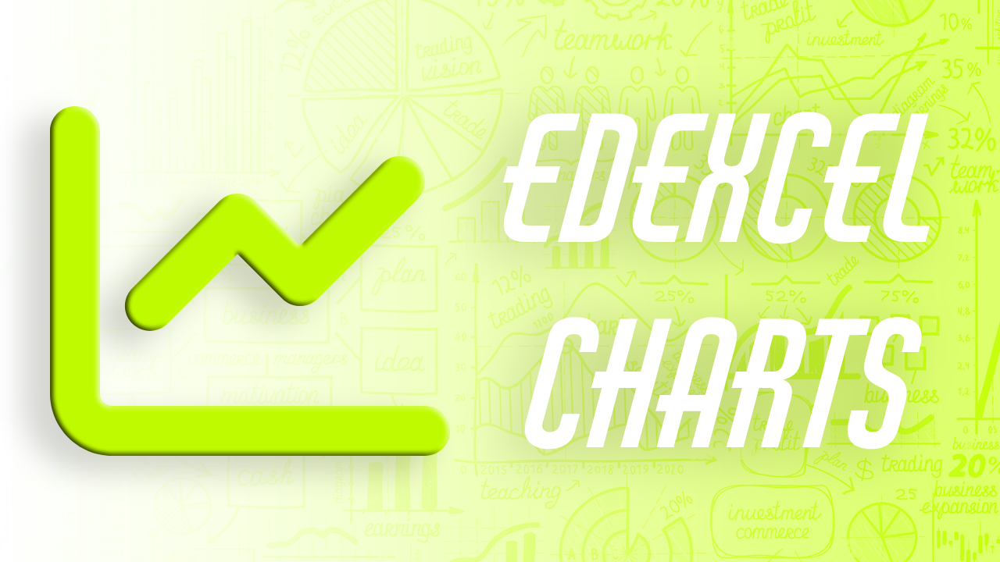

# [Edexcel Charts](https://edexcel-charts.vercel.app/)

## Use Case
- Can be used to see how the UMS has varied over the years
- The trends can be used to predict future trends
- Basically a neat app for all the geeks that love charts

Works **both** on mobile 📱 and desktop 🖥️

## Backend
- Like [Edexcel Finder](https://github.com/anonymouslyanonymous1/Edexcel-Finder), Flask is the library that I used as the backbone for the project
- All the UMS data is stored as JavaScript Objects
- Plotly to generate the graph
- For a detailed explanation of the data collection, check out 
## Frontend
- Raw HTML and CSS has been used

## List of Subjects and Units available
##### Grades available for all: A* (if exists), A, B, C, D, E and most importantly *Full UMS*

##### Chemistry

1. **WCH11/01** – Structure, Bonding and Introduction to Organic Chemistry
2. **WCH12/01** – Energetics, Group Chemistry, Halogenoalkanes and Alcohols
3. **WCH13/01** – Practical Skills in Chemistry I
4. **WCH14/01** – Rates, Equilibria and Further Organic Chemistry
5. **WCH15/01** – Unit 5 Transition Metals and Organic Nitrogen Chemistry
6. **WCH16/01** – Unit 6 Practical Skills in Chemistry II

##### Physics

1. **WPH11/01** – Mechanics and Materials
2. **WPH12/01** – Waves and Electricity
3. **WPH13/01** – Practical Skills in Physics I
4. **WPH14/01** – Further Mechanics, Fields and Particles
5. **WPH15/01** – Unit 5 Thermodynamics, Radiation, Oscillations and Cosmology
6. **WPH16/01** – Unit 6 Practical Skills in Physics II

##### Mathematics

1. **WMA11/01** – Pure Mathematics P1 (New)
2. **WMA12/01** – Pure Mathematics P2 (New)
3. **WMA13/01** – Pure Mathematics P3
4. **WMA14/01** – P4 Pure Mathematics 4

##### Further Mathematics

1. **WFM01/01** – Further Pure Mathematics FP1
2. **WFM02/01** – Further Pure Mathematics FP2
3. **WFM03/01** – Further Pure Mathematics FP3
4. **WST01/01** – Statistics S1
5. **WST02/01** – Statistics S2
6. **WST03/01** – Statistics S3
7. **WME01/01** – Mechanics M1
8. **WME02/01** – Mechanics M2
9. **WME03/01** – Mechanics M3
10. **WDM11/01** – Decision Mathematics D1 (New)

##### Biology

1. **WBI11/01** – Molecules, Diet, Transport and Health
2. **WBI12/01** – Cells, Development, Biodiversity and Conservation
3. **WBI13/01** – Practical Skills in Biology I
4. **WBI14/01** – Energy, Environment, Microbiology and Immunity
5. **WBI15/01** – Unit 5 Respiration, Internal Environment, Coordination and Gene Technology
6. **WBI16/01** – Unit 6 Practical Skills in Biology II
